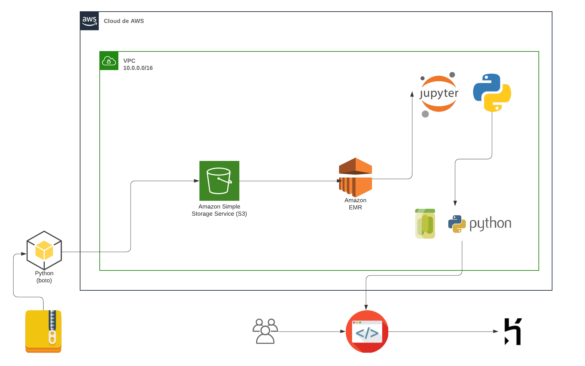
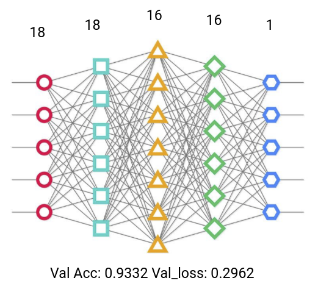

# Proyecto_mineria

Este proyecto hace parte del entregable final de la materia de Mineria de Datos para Grandes Volumenes de Información, el cual tiene como finalidad la implementación de una solución de ML, pero el principal hito era el de enfrentarnos a un problema de grandes volumenes de datos y poder crear una arquitectura escalable.

En este repositorio nos encontraromos con una carpeta de saved_models, que es el proceso resultante de extraer los pesos del modelo para que el código en producción pueda usarlos y que no gaste tiempo computacional entrenandolo ya que para eso esta EMR.

Las carpetas de static y templates hacen parte de la pagina web que fue desplegada en heroku.

Los aarchivos Procfile, app.py, requirements.txt, runtime.txt es necesario para el despliegue de la aplicación.

El jupyter que se encuentra en el repositorio es el mismo usado para el procesamiento y entrenamiento del modelo en EMR.

En el caso de este proyecto nos encontramos con un analizador de sentimos sobre reviews de peliculas, para esto era necesario hacer uso de herramientas como Python, Jupyter, Spark, EMR, Heroku, NLTK, tensorflow, Keras, entre otros.

Ahora se puede ver un poco de la arquitectura propuesta para la solución del Proyecto:

En esta arquitectura podemos evidenciar el uso de S3 para todo el alojamiento de los datos de las reviews de las peliculas necesarias para el entrenamiento del modelo.
Se puede evidenciar el uso de EMR, Jupyter y Python para todo el tema del entrenamiento del modelo.
Por ultimo el despliegue de la pagina web donde se encuentra el modelo en producción que seria del lado de heroku.

Ahora entendiendo un poco el modelo, nos encontramos con la siguiente arquitectura de una red neuronal:

En la arquitectura de la red neuranal podemos ver 3 capas ocultas, una particularidad de esta arquitectura es que se cuenta con dropout para evitar el overfitting.

Dataset:http://ai.stanford.edu/~amaas/data/sentiment/ 

Link del modelo desplegado: https://damp-spire-37704.herokuapp.com/ 
